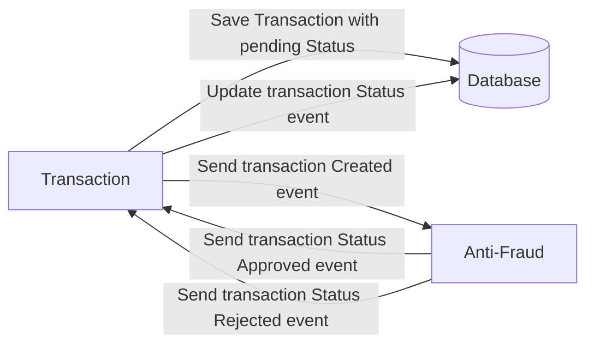

# Problem

Every time a financial transaction is created it must be validated by our anti-fraud microservice and then the same service sends a message back to update the transaction status.
For now, we have only three transaction statuses:

<ol>
  <li>pending</li>
  <li>approved</li>
  <li>rejected</li>  
</ol>

Every transaction with a value greater than 1000 should be rejected.



# Tech Stack

<ol>
  <li>Nestjs, Prisma, nestjs, graphql </li>
  <li>Database: Postgresql</li>
  <li>Kafka</li>
  <li>Docker</li>    
</ol>

We do provide a `Dockerfile` to help you get started with a dev environment.

Run the following commands at the root of the project:

1.- Recommended commands to run the project
```
npm i 
``` 
```
docker-compose -f docker-compose.yml up
```
```
npx prisma migrate dev
```
```
npx prisma db seed
```
```
npm run main:dev
```
```
npm run transaction:dev
```
```
npm run antifraud:dev
```

1. Resource to create a transaction graphql:

```json
mutation{
  createTransaction(input:{
    accountExternalIdCredit:"431f10f2-5247-4c5c-8f86-6ca45d311ec7",
    accountExternalIdDebit: "66d35f0d-2778-4e5b-88de-6380b574d549",
    tranferTypeId: 1,
    value: 120
  }){
    success
    message
  }
}
```

2. Resource to retrieve a transaction

```json
query {
    transaction(id: "1b4b2cdf-2948-445f-9196-599411415169") {
        transactionExternalId transactionType { name } transactionStatus { name }
        value createdAt
    }
}
```

3.- Resource to get transactions.
```json
query {
    transactions(first: 15) {
        transactionExternalId transactionType { name } transactionStatus { name }
        value createdAt
    }
}
```


